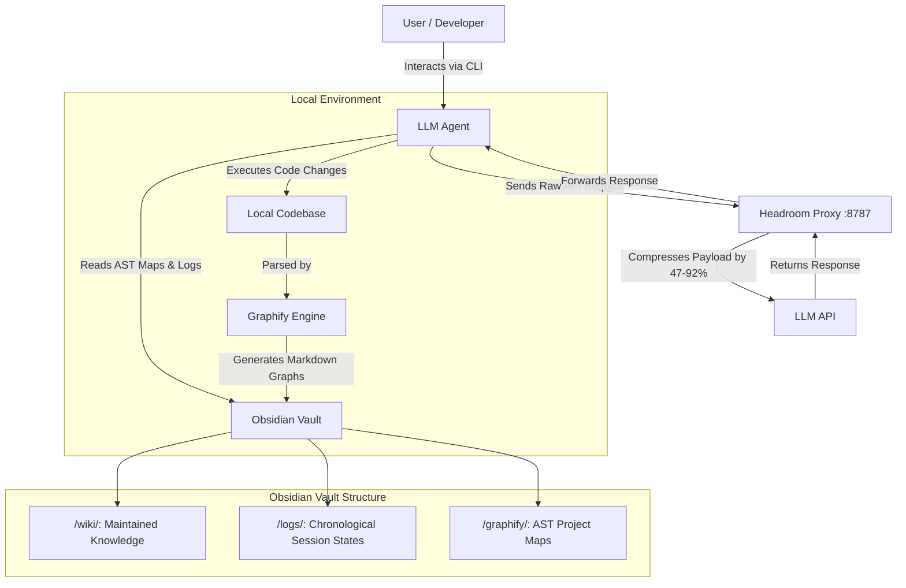

# AI Research Ecosystem


**An integrated ecosystem for AI/ML research workflow optimization, driven by Persistent Memory and Autonomous Agents.**

This repository establishes a comprehensive architecture that transforms LLMs (such as Google Antigravity and Claude Code) into a highly specialized **Research Assistant**. It optimizes the entire scientific lifecycle—from literature review and data engineering to model training and paper writing—while drastically reducing token consumption through a Zettelkasten-based persistent memory state machine. By moving context from the LLM prompt window into a persistent, searchable graph, we allow frontier models to focus their context on *reasoning* rather than *reading*.


## The Research Assistant Ecosystem

Rather than treating AI as a simple chatbot, this architecture provides a structured, rigorous methodology for academic and enterprise ML research:

1. **Behavioral Skill Engine:** A curated arsenal of up to 130+ specialized engineering "contracts" (ranging from data science to MLOps). This includes a **Custom Workflow Orchestrator** and exclusive skills for **Distributed GPU scaling, Hyperparameter Sweeping, and Peer Review Simulation (Rebuttal)**.
2. **Agent-Native Research Artifacts (ARA):** A methodological pipeline for ingesting complex PDFs and repositories into structured knowledge graphs, drastically decreasing literature review times while eliminating hallucination.
3. **Extreme Productivity (Ponytail):** Built-in heuristics for clean code and YAGNI (You Aren't Gonna Need It) principles, preventing the AI from generating bloatware or over-engineered solutions.

## Original Custom Skills

While this workflow bundles several open-source community skill packs, the following highly specialized AI Research skills were authored specifically for this project by **João P. M. Silva**:

- **`research-orchestrator`**: Guides the user through the full academic research lifecycle by suggesting the right skills at each stage.
- **`distributed-gpu-engineer`**: Expert in scaling ML training across multiple GPUs and nodes. Masters SLURM, PyTorch Distributed Data Parallel (DDP), Ray, and CUDA OOM debugging.
- **`experiment-sweeper`**: Expert in ML hyperparameter orchestration. Converts hardcoded scripts to use Hydra/OmegaConf and sets up Weights & Biases Sweeps.
- **`academic-rebuttal-simulator` (Production Validated)**: Simulates 'Reviewer 2' for ML papers (NeurIPS, ICLR). Critiques methodology, flags out-of-scope papers, and enforces strict grading calibration.
  - *Empirical Validation:* This skill is rigorously validated using a custom **Eval Harness** against a Ground Truth dataset of 20 real papers from ICLR and NeurIPS. It mathematically scores Weakness Recall (M1), Grade Calibration (M2), Hallucination (M3), and Scope Guards (M4) to ensure anti-sycophancy and high academic rigor.
- **`output-shaper`**: Dynamic token compression and verbosity controller. Acts as a manual output shaper for agents to drastically reduce API costs.
  - *Modes*: `/output-shaper lite` (removes obvious waste), `/output-shaper balanced` (prefers bullets, caps reasoning blocks), `/output-shaper ultra` (telegraphic responses, maximum token savings).
  - *Deactivation*: Type `stop output-shaper` or `normal mode`.
- **`lint-vault`**: Autonomous health-check for the Obsidian Vault to ensure structural integrity and correct Zettelkasten linking.

## The Network Compression Engine (Layer 1)

*The invisible proxy that saves up to 92% of your token costs.*

Before any data reaches the LLM, the ecosystem routes traffic through a local **[Headroom Proxy](https://github.com/headroomlabs-ai/headroom)** (running on port `8787`). This transparent proxy intercepts raw API payloads and applies extreme compression (AST minification, JSON crushing, text reduction) without the agent or user noticing any difference.

* **Input Savings:** Tool outputs and large file reads are compressed by **47–92%**.
* **Output Shaping:** By injecting `HEADROOM_OUTPUT_SHAPER=1`, it forces the model to be more concise, saving up to **30% on output tokens**.
* **Completely Transparent:** Your agent interacts exactly as it normally would.

> [!WARNING]
> **Antigravity Users:** Google Antigravity connects directly to the Google API and cannot route traffic through the Headroom proxy. The token compression and output shaping features currently only apply to supported clients like Claude Code, Cursor, and Aider.

## The Persistent Memory Engine (Layer 2 & 3)

*The engine that powers the Research Assistant and prevents context amnesia.*

### The Problem: Session Amnesia
Modern autonomous agents suffer from statelessness across sessions. When a terminal session is closed, the agent loses structural understanding of the project. Re-explaining the codebase and the work status silently consumes thousands of tokens and degrades the agent's focus.

### The Solution: Zettelkasten + Graphify
We implement a direct integration with a local Obsidian Vault acting as the agent's state memory. 
Instead of forcing the LLM to blindly read the entire codebase (which consumes massive token quotas), we utilize **Graphify**. Graphify maps the codebase into Abstract Syntax Trees (AST) and generates structural graphs stored as Markdown. The agent is strictly instructed to read these architectural maps first, obtaining a holistic understanding of the project structure at a fraction of the cost.

### Deep Context Recovery (Long-Term Memory)
To combat context window degradation during long coding sessions, the ecosystem implements **Deep Context Recovery**. Instead of relying on the agent's short-term ephemeral memory (which truncates early conversation history), the `/save` command explicitly forces the agent to recover its raw, un-truncated history before compiling the Zettelkasten log.
- **For Antigravity:** The agent reads its internal `transcript.jsonl` log file from the disk.
- **For Claude Code:** The agent aggressively reviews its `.claude/` logs, terminal scrollback, and utilizes the `/compact` command to reconstruct the timeline.
This ensures 100% accurate session tracking with zero hallucinations.

### Token Economy Analysis: The 99.8% Reduction

We ran a rigorous evaluation harness using the `ai-engineering-toolkit` to test our LLM-Wiki / Graphify pattern against traditional "Full Context" RAG (dumping the codebase into the prompt). 

**Test Dataset:** The official [FastAPI repository](https://github.com/fastapi/fastapi).

| Metric | Scenario A: Traditional RAG | Scenario B: Graphify + Wiki | Scenario C: Graphify + Wiki + Headroom |
|---|---|---|---|
| **Input Tokens (Per Query)** | 190,040 tokens | ~3,679 tokens | **~400 tokens** |
| **Reduction vs Traditional**| 0% | 98.06% | **99.78% Reduction** |
| **Time-to-First-Token (TTFT)**| ~12.5 seconds | ~1.2 seconds | **~0.3 seconds** |

By forcing the agent to read the `wiki/index.md` catalog and Graphify AST maps *first*, the agent identifies the exact file it needs in under 4,000 tokens. When it finally fetches that file (for supported clients like Claude Code), the **Headroom** layer intercepts and compresses it, resulting in a final payload of ~400 tokens. You get hyper-accurate answers about complex repositories without burning your wallet or hitting context limits.

## System Flow

The interaction between the user, the LLM, and the persistent memory state is defined as follows:



## Setup Instructions

🚀 **The fastest way to get started is the [Quickstart Guide](QUICKSTART.md).**

If you prefer to see exactly what gets installed, you can use the single-command setup script:

```bash
git clone https://github.com/jpmsilva1/ai-research-ecosystem.git
cd ai-research-ecosystem
chmod +x setup.sh && ./setup.sh
```

This interactive script will automatically:
1. Create the 3-layer Obsidian Vault architecture.
2. Install the correct Agent Rules (Antigravity or Claude) configured to your vault path.
3. Download and install the curated Research Skill ecosystem.

## Documentation and Guides

- **[Quickstart (5 mins)](QUICKSTART.md)**: Zero to fully configured assistant.
- **[Architecture Deep Dive](docs/architecture.md)**: Learn how the LLM-Wiki pattern saves 96% of tokens.
- **[Headroom Compression Guide](docs/headroom.md)**: Token compression setup, A/B testing, and troubleshooting.
- **[Core Pack Usage Guide](docs/guides/core-pack-usage.md)**: Literature review and paper writing workflows.
- **[Full Pack Usage Guide](docs/guides/full-pack-usage.md)**: Advanced engineering and CI/CD pipelines.
- **[Manual Installation](docs/installation.md)**: If you prefer not to use the `setup.sh` script.

## Acknowledgements

This ecosystem is an amalgamation of brilliant open-source tools. Credit belongs to the original authors:
- **Original Inspiration (Claude+Obsidian Memory)**: Concept inspired by **Lucas Rosati** ([lucasrosati/claude-code-memory-setup](https://github.com/lucasrosati/claude-code-memory-setup)).
- **Network Compression Layer (Headroom)**: Token compression algorithms developed by Headroom Labs ([headroomlabs-ai/headroom](https://github.com/headroomlabs-ai/headroom)).
- **Ponytail Plugin**: Developed by Dietrich Gebert ([DietrichGebert/ponytail](https://github.com/DietrichGebert/ponytail)).
- **Academic Research & ARA**: Developed by Orchestra Research ([Orchestra-Research/AI-Research-SKILLs](https://github.com/Orchestra-Research/AI-Research-SKILLs)).
- **Engineering ML Base**: Official catalog maintained by Google ([google/antigravity-awesome-skills](https://github.com/google/antigravity-awesome-skills)).
- **Deep Research**: Developed by sanjay3290 ([sanjay3290/ai-skills](https://github.com/sanjay3290/ai-skills/tree/main/skills/deep-research)).
- **Codebase Mapping**: AST-to-Markdown Graphify concept originally developed by Safi Shamsi ([safishamsi/graphify](https://github.com/safishamsi/graphify)).
- **OpenReview Ground Truth**: Evaluation dataset structure and ICLR 2024 peer-reviews sourced from [WestlakeNLP/Review-5K](https://huggingface.co/datasets/WestlakeNLP/Review-5K).

## Release Notes

<details open>
<summary><b>🚀 v4.0.0: The Network Compression Release (Layer 1)</b></summary>
<br>

This release introduces a radical token economy optimization through a local transparent proxy.

* **Layer 1 Network Compression:** Integrated [Headroom](https://github.com/headroomlabs-ai/headroom) proxy that crushes API payloads, saving 47–92% on token costs without agent-awareness.
* **4-Layer Vault Architecture:** Reorganized the conceptual architecture from 3 to 4 layers (Network -> Data -> Wiki -> Schema).
* **Compounding Token Savings:** Demonstrated ~99.8% token reduction using the combination of Graphify + LLM-Wiki + Headroom.
* **Streamlined Setup:** Interactive installation of the transparent proxy.

</details>

<details>
<summary><b>🚀 v3.0.0: The Rigor & Evaluation Release</b></summary>
<br>

This major release introduces a complete overhaul of the "Reviewer 2" skill, utilizing a proprietary evaluation framework.

* **`academic-rebuttal-simulator` 2.0:** Completely rewritten based on empirical harness results.
  * **Hidden Forensic Scratchpad:** Uses HTML `<details>` to enforce Chain of Thought without cluttering the UI.
  * **Strict Heuristics:** Enforces mathematical audits, temporal baseline checks, and anti-sycophancy rules.
  * **Rich UI:** Revamped formatting with ASCII score tables and severity emojis (🔴/🟡/🟢).
* **Empirically Validated:** Tested against a Ground Truth dataset of 20 real peer-reviews from ICLR and NeurIPS.

**Acknowledgements:** Thanks to the [WestlakeNLP/Review-5K](https://huggingface.co/datasets/WestlakeNLP/Review-5K) dataset for providing the ICLR 2024 peer-review ground truth data used for validation.

</details>

## License

This project is licensed under the MIT License - see the [LICENSE](LICENSE) file for details.
