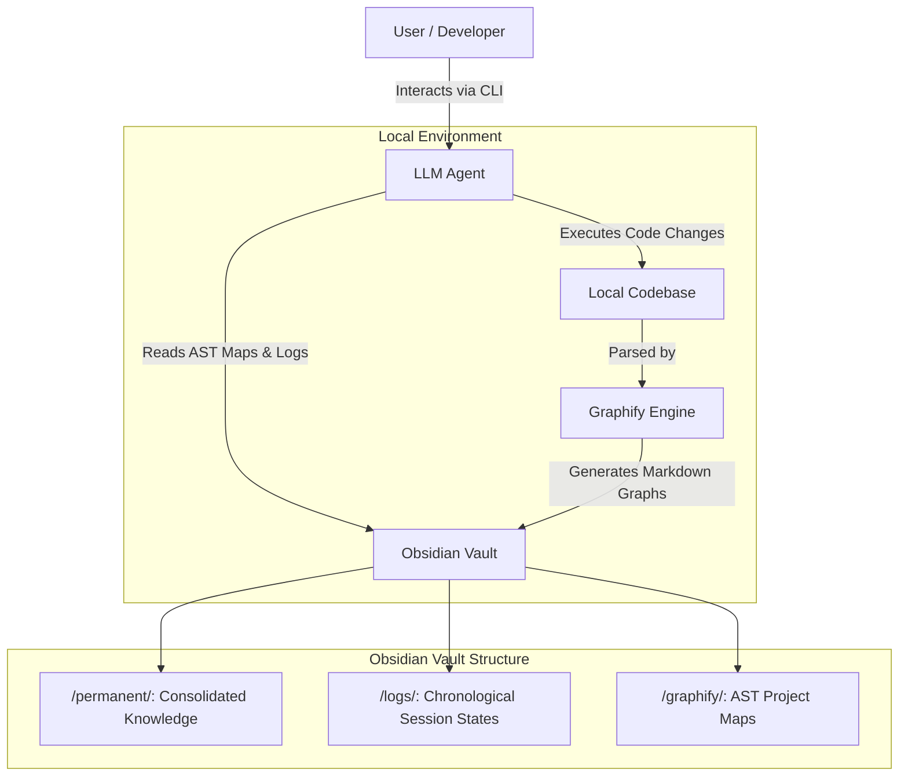

# AI-Powered Research Assistant Architecture


**An integrated ecosystem for AI/ML research workflow optimization, driven by Persistent Memory and Autonomous Agents.**

This repository establishes a comprehensive architecture that transforms LLMs (such as Google Antigravity and Claude Code) into a highly specialized **Research Assistant**. It optimizes the entire scientific lifecycle—from literature review and data engineering to model training and paper writing—while drastically reducing token consumption through a Zettelkasten-based persistent memory state machine.

## The Research Assistant Ecosystem

Rather than treating AI as a simple chatbot, this architecture provides a structured, rigorous methodology for academic and enterprise ML research:

1. **Behavioral Skill Engine:** A curated arsenal of up to 130+ specialized engineering "contracts" (ranging from data science to MLOps). This includes a **Custom Workflow Orchestrator** and exclusive skills for **Distributed GPU scaling, Hyperparameter Sweeping, and Peer Review Simulation (Rebuttal)**.
2. **Agent-Native Research Artifacts (ARA):** A methodological pipeline for ingesting complex PDFs and repositories into structured knowledge graphs, drastically decreasing literature review times while eliminating hallucination.
3. **Extreme Productivity (Ponytail):** Built-in heuristics for clean code and YAGNI (You Aren't Gonna Need It) principles, preventing the AI from generating bloatware or over-engineered solutions.

## Original Custom Skills

While this workflow bundles several open-source community skill packs, the following highly specialized AI Research skills were authored specifically for this project by **João P. M. Silva**:

- **`research-orchestrator`**: Guides the user through the full academic research lifecycle by suggesting the right skills at each stage.
- **`distributed-gpu-engineer`**: Expert in scaling ML training across multiple GPUs and nodes. Masters SLURM, PyTorch Distributed Data Parallel (DDP), Ray, and CUDA OOM debugging.
- **`experiment-sweeper`**: Expert in ML hyperparameter orchestration. Converts hardcoded scripts to use Hydra/OmegaConf and sets up Weights & Biases Sweeps.
- **`academic-rebuttal-simulator`**: Simulates 'Reviewer 2' for ML papers (NeurIPS, ICLR). Critiques methodology, finds missing baselines, and helps draft author rebuttals.
- **`lint-vault`**: Autonomous health-check for the Obsidian Vault to ensure structural integrity and correct Zettelkasten linking.

## The Persistent Memory Engine (Obsidian + Graphify)

*The engine that powers the Research Assistant and prevents context amnesia.*

### The Problem: Session Amnesia
Modern autonomous agents suffer from statelessness across sessions. When a terminal session is closed, the agent loses structural understanding of the project. Re-explaining the codebase and the work status silently consumes thousands of tokens and degrades the agent's focus.

### The Solution: Zettelkasten + Graphify
We implement a direct integration with a local Obsidian Vault acting as the agent's state memory. 
Instead of forcing the LLM to blindly read the entire codebase (which consumes massive token quotas), we utilize **Graphify**. Graphify maps the codebase into Abstract Syntax Trees (AST) and generates structural graphs stored as Markdown. The agent is strictly instructed to read these architectural maps first, obtaining a holistic understanding of the project structure at a fraction of the cost.

### Token Economy Analysis
Empirical measurements on a medium-scale repository (~17,795 lines of code) demonstrated the mathematical advantage of this architecture:
- **Standard Baseline (Brute-force read):** ~170,000 tokens per session.
- **Graphify + Obsidian Vault Architecture:** ~6,000 tokens per session.
- **Net Efficiency Gain:** **~96.4% reduction** in input token consumption.

## System Flow

The interaction between the user, the LLM, and the persistent memory state is defined as follows:



## Setup Instructions

🚀 **The fastest way to get started is the [Quickstart Guide](QUICKSTART.md).**

If you prefer to see exactly what gets installed, you can use the single-command setup script:

```bash
git clone https://github.com/jpmsilva1/ai-research-workflow.git
cd ai-research-workflow
chmod +x setup.sh && ./setup.sh
```

This interactive script will automatically:
1. Create the 3-layer Obsidian Vault architecture.
2. Install the correct Agent Rules (Antigravity or Claude) configured to your vault path.
3. Download and install the curated Research Skill ecosystem.

## Documentation and Guides

- **[Quickstart (5 mins)](QUICKSTART.md)**: Zero to fully configured assistant.
- **[Architecture Deep Dive](docs/architecture.md)**: Learn how the LLM-Wiki pattern saves 96% of tokens.
- **[Core Pack Usage Guide](docs/guides/core-pack-usage.md)**: Literature review and paper writing workflows.
- **[Full Pack Usage Guide](docs/guides/full-pack-usage.md)**: Advanced engineering and CI/CD pipelines.
- **[Manual Installation](docs/installation.md)**: If you prefer not to use the `setup.sh` script.

## Acknowledgements

This ecosystem is an amalgamation of brilliant open-source tools. Credit belongs to the original authors:
- **Original Inspiration (Claude+Obsidian Memory)**: Concept inspired by **Lucas Rosati** ([lucasrosati/claude-code-memory-setup](https://github.com/lucasrosati/claude-code-memory-setup)).
- **Ponytail Plugin**: Developed by Dietrich Gebert ([DietrichGebert/ponytail](https://github.com/DietrichGebert/ponytail)).
- **Academic Research & ARA**: Developed by Orchestra Research ([Orchestra-Research/AI-Research-SKILLs](https://github.com/Orchestra-Research/AI-Research-SKILLs)).
- **Engineering ML Base**: Official catalog maintained by Google ([google/antigravity-awesome-skills](https://github.com/google/antigravity-awesome-skills)).
- **Deep Research**: Developed by sanjay3290 ([sanjay3290/ai-skills](https://github.com/sanjay3290/ai-skills/tree/main/skills/deep-research)).

## License

This project is licensed under the MIT License - see the [LICENSE](LICENSE) file for details.
