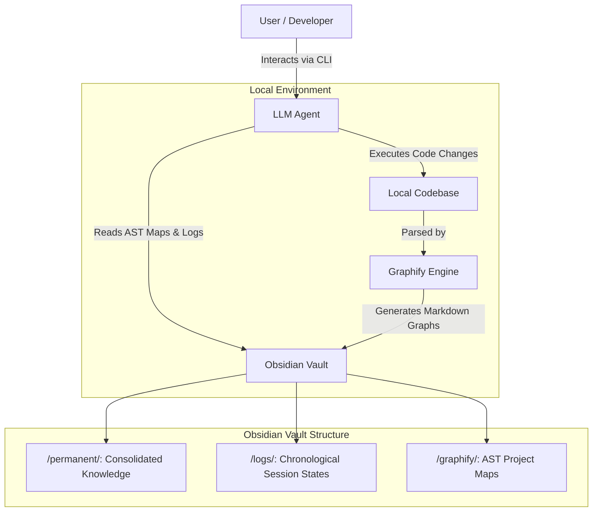

# AI Research Workflow: Persistent Memory for LLMs

**Resolving Context Amnesia in Artificial Intelligence and Autonomous Agents.**

This repository establishes a robust framework allowing LLMs (such as Google Antigravity and Claude Code) to achieve persistent, long-term memory via an Obsidian Vault. By migrating from ephemeral session memory to a Zettelkasten-based state machine, the agent ceases to forget architectural decisions, reducing token expenditure and eliminating the friction of re-explaining context at the start of every session.

## Architecture and Motivation

### The Problem: Session Amnesia
Modern autonomous agents suffer from statelessness across sessions. When a terminal session is closed, the agent loses structural understanding of the project. Re-explaining the codebase and the work status silently consumes thousands of tokens and degrades the agent's focus.

### The Solution: Zettelkasten + Graphify
We implement a direct integration with a local Obsidian Vault acting as the agent's state memory. 
Instead of forcing the LLM to blindly read the entire codebase (which consumes massive token quotas), we utilize **Graphify**. Graphify maps the codebase into Abstract Syntax Trees (AST) and generates structural graphs stored as Markdown. The agent is strictly instructed to read these architectural maps first, obtaining a holistic understanding of the project structure at a fraction of the cost.

### Token Economy Analysis
Empirical measurements on a medium-scale repository (`MSR-TCN-Finance`, ~17,795 lines of code) demonstrated the mathematical advantage of this architecture:
- **Standard Baseline (Brute-force read):** ~170,000 tokens per session.
- **Graphify + Obsidian Vault Architecture:** ~6,000 tokens per session.
- **Net Efficiency Gain:** **~96.4% reduction** in input token consumption.

## System Flow

The interaction between the user, the LLM, and the persistent memory state is defined as follows:

## Setup Instructions

### 1. Initialize the Memory Vault
1. Download [Obsidian](https://obsidian.md/).
2. Copy the `obsidian-vault-template/` directory provided in this repository to your local machine.
3. Open this folder as a new Vault inside the Obsidian application.

### 2. Configure the LLM Agent
Depending on your preferred AI Agent, copy the respective configuration file to your project root to enforce memory awareness:
- **Google Antigravity:** Use `agents/antigravity/AGENTS.md`. It injects the `/salvar` and `/retomar` memory protocols globally.
- **Claude Code (Anthropic):** Use `agents/claude/.cursorrules` to instruct Claude to utilize the Obsidian vault as its long-term memory.

### 3. Install the Skill Ecosystem
To maximize the potential of this architecture, you must install specialized toolsets (Skills) for the agent. We offer autonomous prompt-based installations.

Refer to **[docs/auto-install.md](docs/auto-install.md)** to copy the setup prompts for your desired path:
- **Core Pack (Academic Focus):** Scientific research tools, deep literature review, and Agent-Native Research Artifacts (ARA).
- **Full Pack (Engineering Focus):** Over 130 skills encompassing MLOps, DevOps, TDD, and data engineering.

## Documentation and Guides

Consult the `docs/` directory for comprehensive usage instructions:
- **[Core Pack Usage Guide](docs/guides/core-pack-usage.md)**: Literature review and paper writing workflows.
- **[Full Pack Usage Guide](docs/guides/full-pack-usage.md)**: Advanced engineering and CI/CD pipelines.

## Acknowledgements

This ecosystem is an amalgamation of brilliant open-source tools. Credit belongs to the original authors:
- **Original Inspiration (Claude+Obsidian Memory)**: Concept inspired by **Lucas Rosati** ([lucasrosati/claude-code-memory-setup](https://github.com/lucasrosati/claude-code-memory-setup)).
- **Ponytail Plugin**: Developed by Dietrich Gebert ([DietrichGebert/ponytail](https://github.com/DietrichGebert/ponytail)).
- **Academic Research & ARA**: Developed by Orchestra Research ([Orchestra-Research/AI-Research-SKILLs](https://github.com/Orchestra-Research/AI-Research-SKILLs)).
- **Engineering ML Base**: Official catalog maintained by Google ([google/antigravity-awesome-skills](https://github.com/google/antigravity-awesome-skills)).
- **Deep Research**: Developed by sanjay3290 ([sanjay3290/ai-skills](https://github.com/sanjay3290/ai-skills/tree/main/skills/deep-research)).

## License

This project is licensed under the MIT License - see the [LICENSE](LICENSE) file for details.
