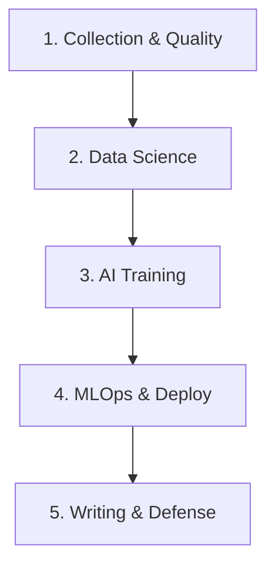

# Core Pack Usage Guide (Academic Research)

Welcome to your advanced research arsenal! We have curated a specialized set of skills focused on your Master's in Computer Science (AI and Data Engineering). Skills are "behavioral contracts": advanced instructions that force the agent to act as a Senior specialist in specific areas, ensuring the generated code maintains academic rigor and production quality.

---

## 🛠️ How to Invoke Skills?

You don't need to memorize all the skills. The ecosystem works in two ways:

1. **Implicit Invocation (Default):** If you say *"Train a CNN for image classification,"* the agent will automatically fetch the Machine Learning and PyTorch guidelines from its skills.
2. **Explicit Invocation (Recommended):** If you want to guarantee the use of a specific architecture or pattern, mention the skill directly:
   > *"Assume the `ml-engineer` skill and optimize tensor usage in this function."*
   > *"Write statistical tests using the `data-scientist` skill."*

---

## 🧭 The Research Lifecycle and Your Skills

Your master's degree will go through several phases. Here is how Artificial Intelligence will assist you in each of them using the installed packages.

### 0. 📚 Literature Review and State of the Art
*Before touching the data, you must map what has already been published and define the problem.*

* **`papers-skill`**: For the pure academic workflow. Connects to *Semantic Scholar* (200M+ papers) and *arXiv*. Invoke this skill to fetch references, check citations, and download/read PDFs directly.
* **`deep-research`**: The autonomous researcher. Give it a complex dissertation topic and it will spend hours reading sources, cross-referencing information, and synthesizing the state of the art into a comprehensive report.
* **`exa-search` & `tavily-web`**: Semantic search engines built for AI. Instead of just reading Google titles, they navigate pages, extract complete tutorials, and scour the deep web.
* **`research-brainstorming`**: Structured ideation framework. Use it when trying to find new research problems or explore non-obvious angles on the state of the art.
* **`creative-thinking`**: Uses cognitive science models (associations, constraint manipulation) to force creative thinking in research. Excellent for seeking genuinely novel approaches.
* **ARA Ecosystem**: The machine for grinding articles and mapping the scientific method. Use only for the MOST important references of your research.
  * **`ara-compiler`**: The main engine. Pass a PDF, a repository, or raw notes, and it will deconstruct the article into a structured "data web". Extracts logical claims, isolated evidence tables, and exploration graphs.
  * **`ara-research-manager`**: The provenance logger. Use at the end of a long experimentation session. It scans the conversation history and extracts the decisions made, dead ends faced, and "pivots", saving everything in ARA format so your research history is never lost.
  * **`ara-rigor-reviewer`**: The board critic. Runs on top of an already generated ARA artifact and evaluates 6 dimensions of epistemic rigor (evidence relevance, falsifiability, scope calibration). It issues an "Accept" or "Reject" recommendation on the reasoning.

### 1. 🗄️ Collection, Quality, and Data Engineering
*Where research begins: extracting and processing raw data.*

* **`data-engineering-data-pipeline`**: Transforms the agent into a Data Pipeline Architecture Specialist to build massive batch or streaming processing flows.
* **`data-engineering-data-driven-feature`**: Helps build features (*Feature Engineering*) guided by data insights, A/B testing, and continuous measurement before training.
* **`data-structure-protocol`**: Provides "persistent structural memory" over your research code. Allows the agent to navigate your architecture and understand connections without rereading the entire repository.
* **`dbt-transformation-patterns`**: The gold standard for creating scalable data transformation pipelines using SQL and `dbt`. Transforms raw logs into analytical tables.
* **`data-quality-frameworks`**: Research without reliable data is invalid. This skill applies *Great Expectations* and data contracts to validate anomalies, missing data, and schema breaks.
* **`database-architect` & `database-optimizer`**: Use when designing the database that will store experiments. The agent will choose the right indexes and optimize slow queries in PostgreSQL or MongoDB.
* **`polars`**: A "turbocharged" alternative to Pandas. When dealing with massive academic datasets that crash your RAM, invoke this skill to write ultra-fast code with *Lazy Evaluation*.

### 2. 📊 Data Science and Statistical Analysis
*Ensuring mathematical rigor and hypothesis validation.*

* **`data-scientist`**: Transforms the assistant into a statistical researcher. Instead of just "taking the average", it evaluates probability distributions, removes outliers, chooses between parametric/non-parametric tests (ANOVA, T-Test, Kruskal-Wallis), and calculates *p-values* rigorously.
* **`data-storytelling`**: Perfect models are useless if not communicated well. This skill transforms raw matrices into engaging and visually logical narratives, fundamental for the "Results Discussion" of your paper.
* **`plotly`**: The definitive library for interactive data visualization. Invoke this skill when you need to generate rich graphs (with zoom, hover, pan) in the browser to explore data, instead of generating basic static images (`.png`).
* **`python-pro` & `python-patterns`**: Ensures all analytical code is written in the most modern Python versions (3.12+), using static typing, list comprehensions, and vectorized code with **NumPy/SciPy**.

### 3. 🧠 Machine Learning and Deep Learning Training
*The creation of intelligence.*

* **`ml-engineer` & `ai-ml`**: Forces the use of *Best Practices* for PyTorch or TensorFlow. Avoids data leakage in cross-validation, suggests modern architectures (ResNet, Transformers, Diffusion), and manages correct GPU (CUDA) usage.
* **`distributed-gpu-engineer`**: Scales your models to clusters (SLURM, Ray, PyTorch DDP) and debugs CUDA OOMs. **Mandates and deeply analyzes cluster documentation to prevent configuration errors.** *(Created by João P. M. Silva)*
* **`ai-engineering-toolkit`**: The Swiss Army knife of modern AI Engineering. Brings production-ready workflows: prompt evaluation across 8 dimensions, context limit planning, agent security auditing, and *eval harnesses* creation.
* **`rag-engineer` & `embedding-strategies`**: Essential if your thesis involves Large Language Models (LLMs) reading documents. Creates perfect *Retrieval-Augmented Generation* flows, using vector databases like Pinecone or pgvector.
* **`hugging-face-datasets` & `hugging-face-community-evals`**: Use when you need to download *Open Source* models from Hugging Face, or when you want to run *benchmarks* (standard academic evaluations) on your model locally.

### 4. ⚙️ MLOps, Deploy, and Quality Assurance (QA)
*Leaving the Jupyter Notebook and creating systems that do not break.*

* **`experiment-sweeper`**: Refactors hardcoded scripts into Hydra configs and sets up W&B hyperparameter sweeps. *(Created by João P. M. Silva)*
* **`ml-pipeline-workflow` & `mlops-engineer`**: Jupyter Notebooks are great for testing, but terrible for production. These skills encapsulate your models in REST APIs (FastAPI), implement experiment tracking (MLflow/Weights & Biases), and monitor model degradation.
* **`docker-expert` & `devops-deploy`**: Teaches the agent to write the perfect `Dockerfile` for your model, solving Machine Learning library dependency hells, so any member of your board can run your code flawlessly.
* **`unit-testing-test-generate`**: Autonomous test creation in `PyTest`. Use to guarantee that your custom Loss Function contains no hidden mathematical bugs.

### 5. 🎓 Writing, Documentation, and Defense
*Preparing scientific articles and the final dissertation.*

* **`academic-rebuttal-simulator`**: Acts as a harsh 'Reviewer 2' to critique your methodology before submission and helps draft rebuttals. *(Created by João P. M. Silva)*
* **`ml-paper-writing`**: The golden skill for writing *Top-Tier* articles (NeurIPS, ICML). Brings the writing style of industry giants, and features a strict "anti-hallucination" lock that fetches BibTeX directly from the Semantic Scholar API.
* **`academic-plotting`**: The complement to Plotly, focused on generating static graphs of the highest visual quality for final article submission (using matplotlib/seaborn with specific conference styles).
* **`2slides-ppt-generator`**: The salvation for seminars! Ask the agent to read a results summary (*abstract* or *log*) and activate this skill; it will automatically generate the structure, talking points, and code for an AI-based professional slide presentation.
* **`latex-paper-conversion`**: Need to submit your article to another journal? Instead of fighting packages and `.cls` in Overleaf, pass the `.tex` code. The agent formats and converts automatically between templates (e.g., Springer, MDPI, IEEE, Nature).
* **`architecture-decision-records` (ADR)**: In your master's, you will make complex decisions (e.g., "Why did I choose LSTM instead of Transformer?"). This skill generates a formal document justifying your choice, trade-offs, and context — perfect to add as an appendix to the thesis.
* **`docs-architect`**: A documentation architect. Transforms folders full of complex Python scripts into readable and professional documentation for publishing to the scientific community (e.g., GitHub Pages or ReadTheDocs).

---

### 6. 🚀 Extreme Productivity and Clean Code (Ponytail Plugin)
*The veteran senior developer who writes little code, but perfect code.*

* **What it is:** A special installed plugin (`DietrichGebert/ponytail`) that eliminates the AI's tendency to create overly complex code (*over-engineering*).
* **Special Commands:**
  * **`/ponytail-review`**: Forces a review of your current code and provides a list of everything that can be DELETED or replaced by native language functions.
  * **`/ponytail-audit`**: Performs a complete sweep of your entire project hunting for bloatware and useless complexity.
  * **`/ponytail [lite | full | ultra]`**: Defines the "laziness level" (or objectivity) the agent should have when programming.
  * **`/ponytail-debt`**: Logs technical shortcuts taken so technical debt is not forgotten.

---

### 7. 🧠 Persistent Memory (Antigravity + Obsidian + Graphify)
*Artificial intelligence systems typically suffer from amnesia between sessions. We have configured an architecture for the agent to have a permanent memory of your research project using Obsidian.*

* **The Concept:** The agent is globally configured to interact with a vault located at `~/Documents/AntigravityBrain/`. Instead of spending tokens rereading your entire code every session, the agent consults the structural mapping and logbook stored in this vault.
* **Integration with `graphify`**: The code mapping of your project is extracted via `graphify` and stored in the `/graphify/` folder of Obsidian. The agent navigates these logical connections instantly.
* **The Session Workflow:**
  * **Upon closing (`/save`):** When finishing a day of research, type `/save`. An official log will be created in the `/logs/` folder detailing decisions, context, and pending tasks.
  * **Upon starting (`/resume`):** In a new conversation, type `/resume`. The agent will read the latest files generated in your vault and perfectly recover the context of where you left off.

---

> [!NOTE]
> **Daily Tip for your Master's:** The AI is not just for generating code! If you are stuck on the design of an experiment, use the `/grill-me` command. The assistant will conduct a battery of methodological questions about your paper to uncover logical holes *before* you spend money running models in the cloud!
